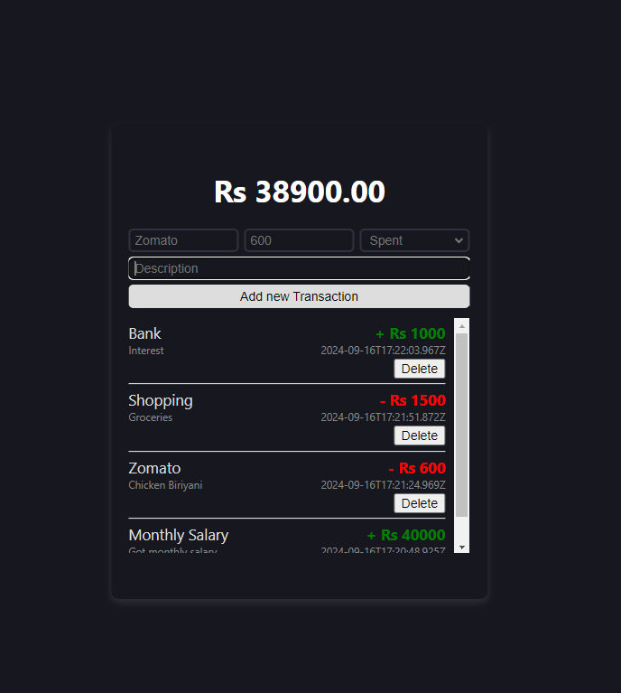

# Money Tracker App

A full-stack personal finance tracker that helps users manage their transactions and balance dynamically. Built with a React frontend, Node.js and Express.js backend, and MongoDB database using Mongoose for data management.

## Features
- **Dynamic Transaction Management**: Users can add, update, and delete transactions.
- **Real-time Balance Update**: User's balance is updated dynamically based on transactions.
- **Database Integration**: All transaction data is stored in a MongoDB database using Mongoose for schema management.
- **Responsive Frontend**: A user-friendly React-based interface for seamless interaction.
- **RESTful APIs**: Integration between frontend and backend for real-time data fetching and updating.
- **Clear Transaction List**: A 'Clear' button on the frontend to reset transaction details without affecting the database.

## Technologies Used
- **Frontend**: React, JavaScript, HTML, CSS
- **Backend**: Node.js, Express.js
- **Database**: MongoDB, Mongoose
- **API**: RESTful API for data communication between frontend and backend
- **Environment Management**: `.env` for handling environment variables
- **Version Control**: Git

## Setup

1. Clone the repository:
    ```bash
    git clone https://github.com/Abhik-Chakraborty/money-tracker-frontend.git
    ```

2. Navigate into the project directory:
    ```bash
    cd money-tracker-app
    ```

3. Install dependencies for backend :
    ```bash
    npm install
    ```

4. Create a `.env` file in the root directory for environment variables.

5. Start the development servers:
    ```bash
    npm start
    ```

## Environment Variables

Create a `.env` file in the root directory and add the following:




